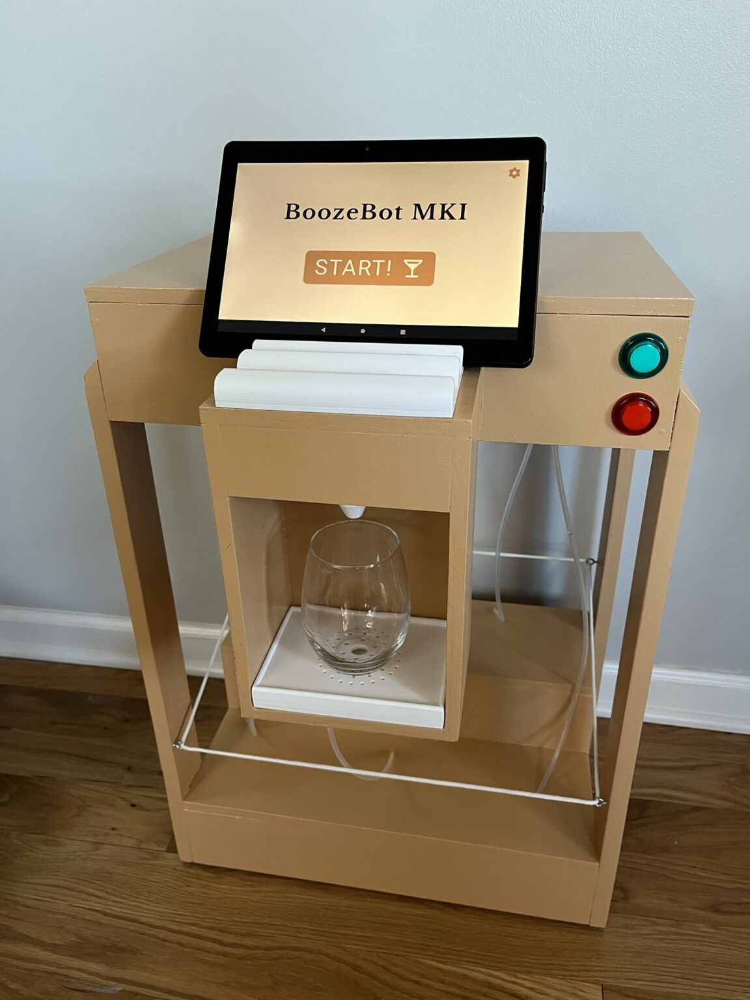
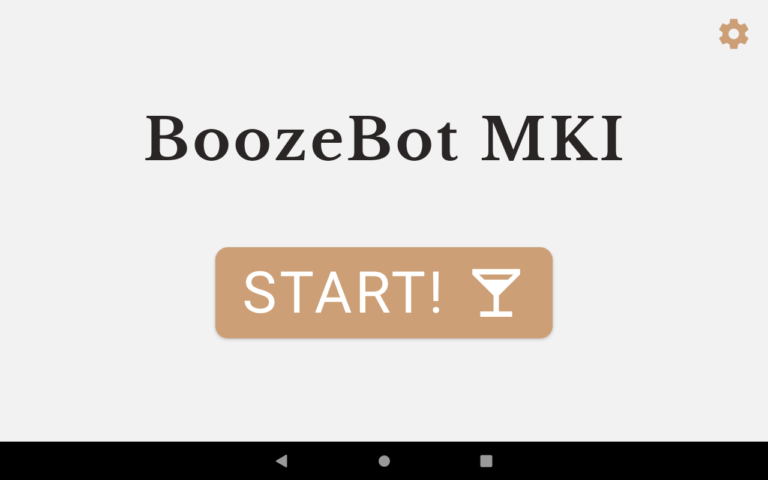
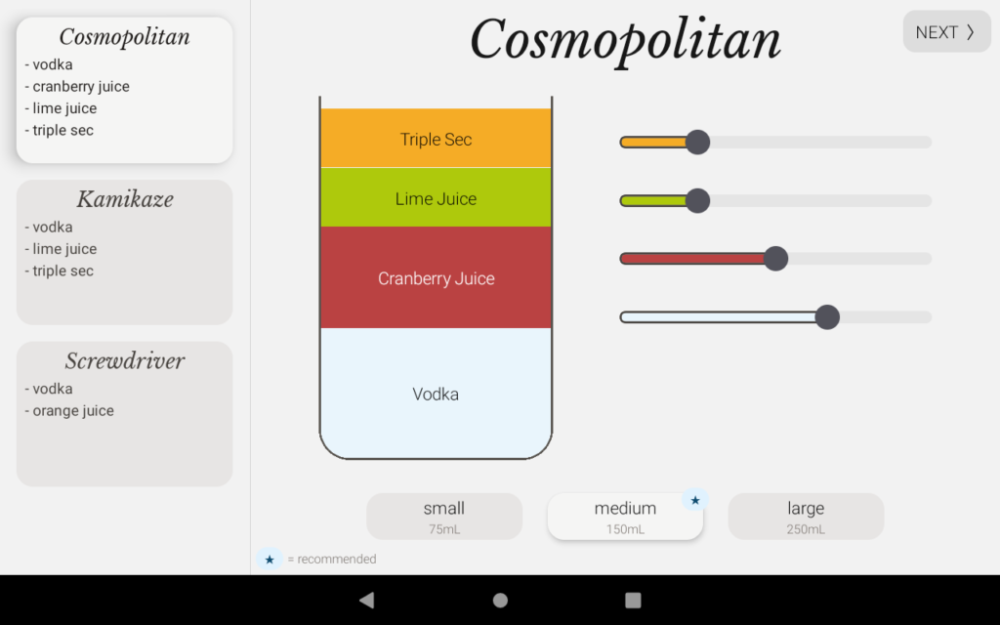
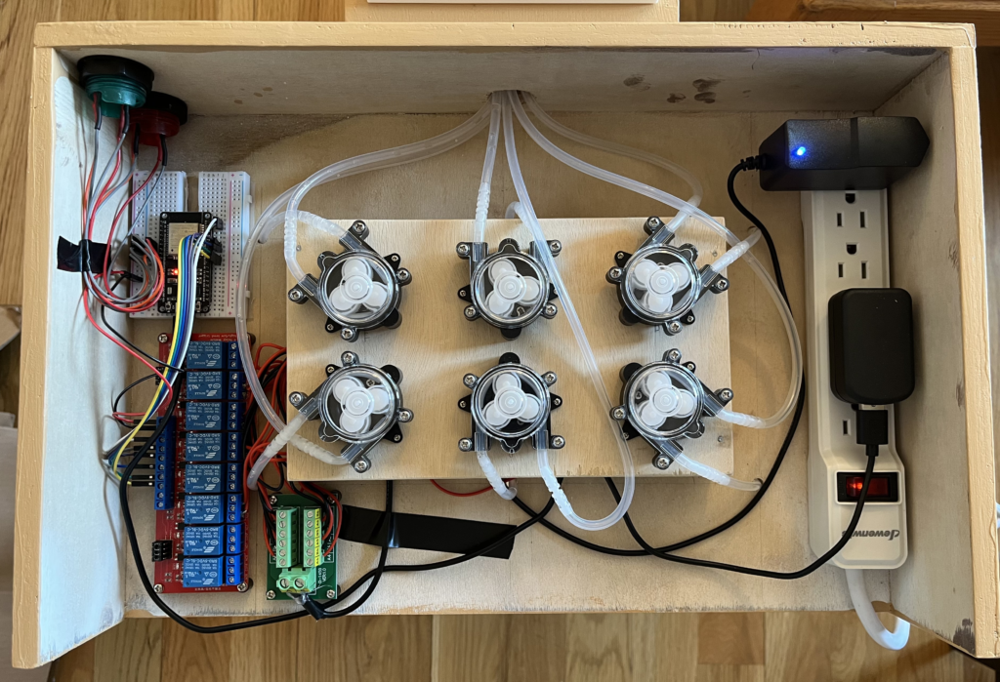

# BoozeBot: A DIY Cocktail-Making Machine

BoozeBot is a bartending, drink-mixing, cocktail-making robot! Load the machine with ingredients of your choice, select a cocktail from the list shown on the touchscreen, and watch as BoozeBot dispenses the right amount of each required ingredient into your glass.

**Blog Post:** https://russ-stuff.com/projects/boozebot/



Six peristaltic pumps, controlled by an ESP32 microcontroller, are turned on and off at precise times to move ingredients directly from their bottles, out the dispenser nozzle, and into your glass via food-safe flexible tubing. The ESP module communicates with a cheap android tablet running a react-native app that displays the menu to the user. The app also allows for direct manual control of the pumps (which is useful for cleaning).

This project took a few weeks to design and about a month for my friend and I to build in our garage. Total cost was around $200 for parts and materials.

## Kiosk App

The android kiosk app was developed using React Native and TypeScript. It serves as the primary user interface.

<div style="display: flex; gap: 10px;">
  
  
</div>

The tablet has a small database of cocktail recipes. A recipe consists of a list of ingredients and their associated proportions as well as some metadata. Ratios can be customized via the kiosk.

```typescript
{
	name: "Cosmopolitan",
	ingredients: [
		[INGREDIENTS.vodka, 4],
		[INGREDIENTS.cranberry_juice, 3],
		[INGREDIENTS.lime_juice, 1.5],
		[INGREDIENTS.triple_sec, 1.5]
	],
	recommendedSize: "medium"
}
```

## Electronics

The brains of the operation is an ESP32 module (top left) which was chosen for its low power consumption, abundance of GPIO pins, and onboard Bluetooth. The ESP32 is connected to a 5V relay board (bottom left) which serves to switch the pumps on and off. The pumps are powered by a 6V power supply (top right). A block distribution terminal (bottom middle-left) splits the incoming power to the 6 independent loads.



Each pump draws in the neighborhood of 250mA. The red and green buttons (and their onboard LEDs) and also connected directly to the ESP32 via GPIO. 

### Bluetooth Protocol

The tablet and the micro-controller interact over bluetooth via a simple command/telemetry protocol.

PumpController -> Kiosk:
 - Request Order Start
 - Notify Order Started (with ETA)
 - Notify Order Finished
 - Notify Order Canceled

Kiosk -> PumpController:
 - Signal Order Start (with order details)
 - Signal Manual Control
 - Notify UI State (for green button LED)


See the full [blog post](https://russ-stuff.com/projects/boozebot/) for more info!
